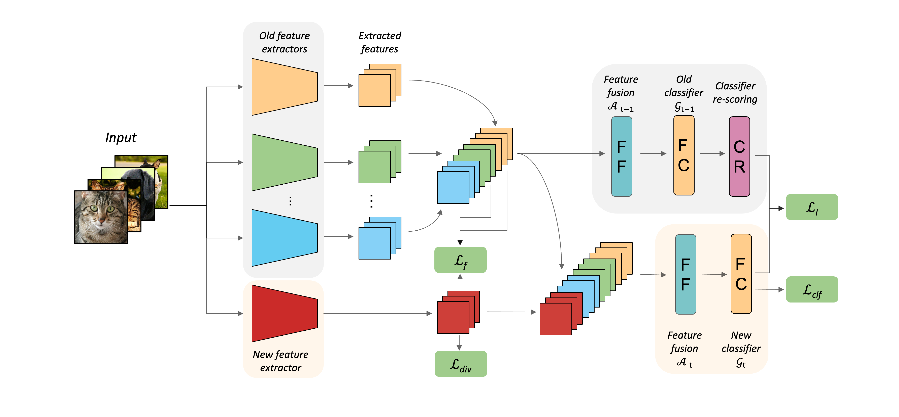
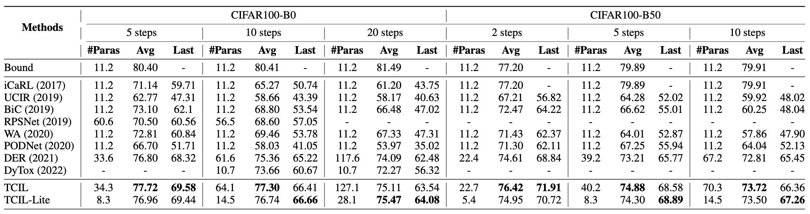
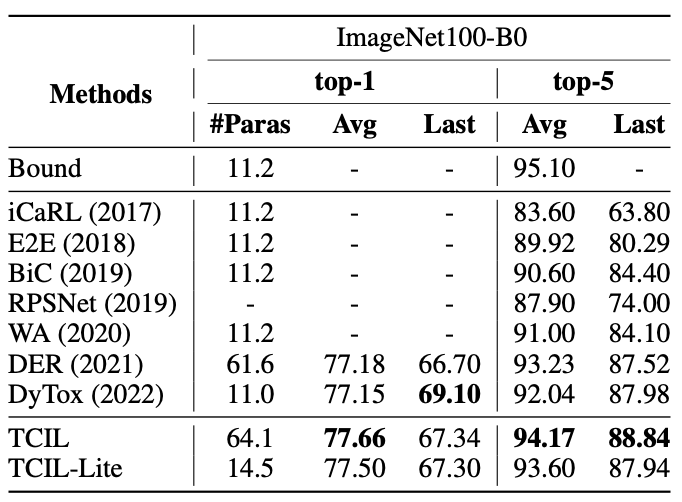
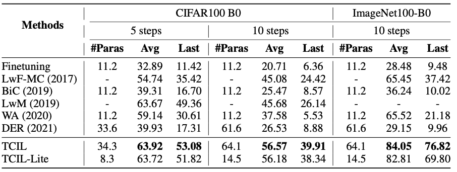

<div align="center">

# TCIL

## Resolving Task Confusion in Dynamic Expansion Architectures for Class Incremental Learning





</div>


# Datasets

- Training datasets
    1. CIFAR100: 
        CIFAR100 dataset will be auto-downloaded.
    2. ImageNet100:
       ImageNet100 is a subset of ImageNet. You need to download ImageNet first, and split the dataset refer to [ImageNet100_Split](https://github.com/arthurdouillard/incremental_learning.pytorch).
 
- Class ordering
    - We use the class ordering proposed by [DER](https://github.com/Rhyssiyan/DER-ClassIL.pytorch).
 
- Structure of `data` directory
    ```
    data
    ├── cifar100
    │   └── cifar-100-python
    │       ├── train
    │       ├── test
    │       ├── meta
    │       └── file.txt~
    │      
    ├── imagenet100
    │   ├── train
    │   └── val
    ```
 
# Environment
You can find all the libraries in the `requirements.txt`, and configure the experimental environment with the following commands.

```
conda create -n TCIL python=3.8
conda install pytorch==1.8.1 torchvision==0.9.1 cudatoolkit=11.1 -c pytorch
pip install -r requirements.txt
```
Thanks for the great code base from [DER](https://github.com/Rhyssiyan/DER-ClassIL.pytorch).
# Launching an experiment
## Train
`sh scripts/run.sh`
## Eval
`sh scripts/inference.sh`
## Prune
`sh scripts/prune.sh`


# Results

## Rehearsal Setting




## Non-Rehearsal Setting



## Checkpoints

Get the trained models from [BaiduNetdisk(passwd:q3eh)](https://pan.baidu.com/s/1G0XVZCaaZ2LmM_eppr3cXA), [GoogleDrive](https://drive.google.com/drive/folders/1y9AXRdsmIYGWWS6erG3_VxFSeroohHT6?usp=sharing). 
(We both offer the training logs in the same file)

